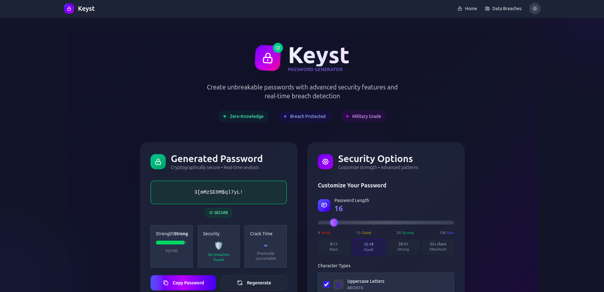

# 🔐 Keyst - Advanced Password Generator

**Keyst** is a state-of-the-art, security-first password generator built with modern web technologies. It combines military-grade encryption, real-time breach detection, and an intuitive user interface to deliver the most secure password generation experience available.



## 🚀 Features

### 🔒 **Enterprise-Grade Security**
- **Cryptographically Secure Random Generation** - Uses `crypto.getRandomValues()` for true randomness
- **Real-time Breach Detection** - Checks against HaveIBeenPwned database using k-anonymity
- **Advanced Pattern Analysis** - Detects and prevents weak patterns automatically
- **Entropy Calculation** - Provides accurate password strength assessment
- **Zero Data Transmission** - All processing happens client-side
- **Data Breach News** - Up-to-date information on recent security incidentsdvanced Password Generator

### ⚡ **Advanced Customization**
- **Flexible Length Control** - 4-128 characters with visual feedback
- **Character Set Options** - Uppercase, lowercase, numbers, symbols
- **Extended Symbol Support** - Additional special characters for maximum security
- **Ambiguous Character Filtering** - Excludes confusing characters (0, O, 1, l, I, |)
- **Sequential Pattern Prevention** - Automatically avoids predictable sequences
- **Complexity Enforcement** - Ensures strong character distribution

### 🎨 **Modern User Experience**
- **Glass Morphism Design** - Beautiful, modern UI with backdrop blur effects
- **Dark/Light Mode** - Automatic system preference detection with manual toggle
- **Smooth Animations** - Powered by Framer Motion for delightful interactions
- **Responsive Design** - Perfect experience on desktop, tablet, and mobile
- **Keyboard Shortcuts** - Power user features (Ctrl/Cmd + G, Ctrl/Cmd + C)
- **Accessibility First** - Screen reader friendly with proper ARIA labels

### 🛡️ **Security Analysis Dashboard**
- **Real-time Strength Assessment** - Multi-factor password strength evaluation
- **Breach Status Monitoring** - Instant breach detection with detailed reporting
- **Cracking Time Estimation** - Realistic time-to-crack calculations
- **Security Recommendations** - Personalized tips for better password hygiene
- **Comprehensive Audit Trail** - Detailed security analysis with actionable feedback
- **Latest Breach News** - Stay informed about recent data breaches and security incidents

## 🛠️ Tech Stack

- **[Vite](https://vitejs.dev/)** - Lightning-fast build tool and dev server
- **[React 19](https://react.dev/)** - Latest React with modern features
- **[TypeScript](https://www.typescriptlang.org/)** - Full type safety and developer experience
- **[Framer Motion](https://www.framer.com/motion/)** - Production-ready motion library
- **[Tailwind CSS](https://tailwindcss.com/)** - Utility-first CSS framework
- **[HaveIBeenPwned API](https://haveibeenpwned.com/API/v3)** - Breach detection service

## 📦 Installation & Setup

### Prerequisites
- Node.js 18+ and npm/yarn/pnpm
- Modern browser with Web Crypto API support

### Quick Start

```bash
# Clone the repository
git clone https://github.com/jonnelmlique/keyst.git
cd keyst

# Install dependencies
npm install

# Start development server
npm run dev

# Build for production
npm run build

# Preview production build
npm run preview
```

### Development Commands

```bash
npm run dev      # Start dev server with hot reload
npm run build    # Build for production
npm run preview  # Preview production build
npm run lint     # Run ESLint
npm run type-check # TypeScript type checking
```

## 🔐 Security Features Deep Dive

### Cryptographic Security
- **CSPRNG**: Uses `crypto.getRandomValues()` for cryptographically secure randomness
- **Entropy Calculation**: Accurately measures password strength using Shannon entropy
- **Pattern Detection**: Advanced algorithms to detect and prevent weak patterns
- **Character Distribution**: Ensures optimal distribution across character sets

### Privacy Protection
- **Zero Data Collection**: No passwords, settings, or user data is ever stored
- **Client-Side Processing**: All operations happen in your browser
- **No Analytics**: No tracking, cookies, or user behavior monitoring
- **Transparent Source**: Open source with auditable security practices

### Breach Detection
- **HaveIBeenPwned Integration**: Real-time checking against 10+ billion compromised passwords
- **K-Anonymity**: Only partial password hashes are transmitted for privacy
- **Instant Feedback**: Immediate breach status with detailed information
- **Historical Context**: Shows breach count and severity

### Data Breach News
- **Latest Security Incidents**: Comprehensive list of recent data breaches
- **Detailed Breach Information**: View affected services, dates, and compromised data types
- **Affected Accounts Tracking**: See how many accounts were compromised in each breach
- **Security Recommendations**: Get actionable advice for each breach
- **In-App Details**: View all breach information without leaving the application
- **Verification Status**: Know which breaches have been independently verified

## 🎯 Usage Examples

### Basic Password Generation
1. Open Keyst in your browser
2. Adjust length and character options
3. Click "Generate New Password" or press Ctrl/Cmd + G
4. Copy with the button or press Ctrl/Cmd + C

### Advanced Security Mode
1. Enable "Extended Symbols" for maximum character variety
2. Turn on "Avoid Sequential Patterns" to prevent predictable sequences
3. Use "Ensure High Complexity" for guaranteed strong distribution
4. Enable "Exclude Ambiguous Characters" for better readability

### Security Analysis
1. Generate a password with your preferred settings
2. Click on the security audit panel to expand detailed analysis
3. Review breach status, security issues, and recommendations
4. Adjust settings based on feedback for optimal security

### Exploring Data Breach News
1. Click on "Data Breaches" in the navigation bar
2. Browse the list of recent security incidents
3. Click on a breach to view detailed information
4. Read security recommendations specific to each breach
5. Use the "Back to all breaches" button to return to the list view

## 🎨 Design Philosophy

Keyst follows a **security-first, user-friendly** design philosophy:

- **Minimalist Interface**: Clean, distraction-free design focusing on the essential task
- **Glass Morphism**: Modern aesthetic with backdrop blur and transparency effects
- **Adaptive Colors**: Dynamic color system that responds to content and theme
- **Micro-interactions**: Subtle animations that provide feedback and delight
- **Information Hierarchy**: Clear visual hierarchy that guides user attention

## 🧪 Testing & Quality Assurance

### Security Testing
- Regular security audits of the password generation algorithm
- Penetration testing of the breach detection implementation
- Code review focusing on cryptographic best practices
- Automated testing of edge cases and error conditions

### Browser Compatibility
- Chrome 90+ ✅
- Firefox 90+ ✅
- Safari 14+ ✅
- Edge 90+ ✅

### Performance Metrics
- First Contentful Paint: < 1.2s
- Largest Contentful Paint: < 2.5s
- Cumulative Layout Shift: < 0.1
- First Input Delay: < 100ms

## 📊 Security Metrics

- **Randomness Quality**: Passes NIST randomness tests
- **Entropy Strength**: Minimum 60 bits for "strong" classification
- **Breach Coverage**: Checks against 10+ billion compromised passwords
- **Response Time**: < 500ms for breach checking
- **Client-Side Only**: Zero server-side password processing

## 🗺️ Roadmap

### v2.0 (Current)
- [x] Data Breach News with detailed information
- [ ] Password history with secure storage
- [ ] Bulk password generation
- [ ] Advanced regex pattern support
- [ ] Password aging recommendations
- [ ] Integration with password managers

### v2.1 (Future)
- [ ] Multi-language support
- [ ] Custom character sets
- [ ] Password policy templates
- [ ] Security compliance reporting

## 📄 License

This project is licensed under the MIT License - see the [LICENSE](LICENSE) file for details.

## 🙏 Acknowledgments

- [HaveIBeenPwned](https://haveibeenpwned.com/) for breach detection API
- [Tailwind CSS](https://tailwindcss.com/) for the design system
- [Framer Motion](https://www.framer.com/motion/) for animations
- The open source community for continuous inspiration

## 🔗 Links

- **Demo**: [keyst-password.vercel.com](https://keyst-password.vercel.com)

---

<div align="center">

**Built with ❤️ for a more secure web**

</div>
